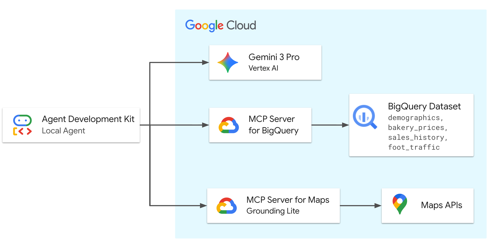

# Bakery Location Intelligence: MCP AI Agent

[](https://cloud.google.com/)
[](https://modelcontextprotocol.io/)
[](https://deepmind.google/technologies/gemini/)

## Project Overview
This repository contains my implementation and customization of a location intelligence AI agent built using the **Model Context Protocol (MCP)**. I adapted and extended the project to demonstrate how an LLM (Gemini) can bridge the gap between static enterprise data and real-world geospatial intelligence.

The agent solves a complex business challenge: **Identifying the optimal location and pricing strategy for a premium sourdough bakery in Los Angeles.**

### The Logic
The agent doesn't just "guess." It performs a series of reasoned steps:
1. **Macro-Discovery:** Queries **BigQuery** to find zip codes with high morning foot traffic.
2. **Competitive Analysis:** Uses **Google Maps** to verify bakery density in those specific areas.
3. **Pricing Strategy:** Analyzes market trends to establish a premium price point (e.g., ~$18 for a sourdough loaf).
4. **Forecasting:** Runs sales projections based on historical data patterns.

---

## Architecture


This project utilizes the **Google ADK (Agent Development Kit)** to orchestrate requests between the user and Google Cloud services via a remote MCP server.

---

## Repository Structure

```text
launchmybakery/
├── adk_agent/           # AI Agent Application (Logic & Tools)
│   └── agent.py         # Main agent definition and prompt logic
├── data/                # Synthetic datasets (Demographics, Prices, Traffic)
├── setup/               # Infrastructure automation (BigQuery & Env setup)
├── .env.example         # Template for required API keys and Project IDs
└── README.md            # Project documentation
```

---

## Setup & Deployment Guide

### 1. Clone the Workspace

```bash
git clone https://github.com/linaelkhateeb/bakery-location-intelligence-agent.git
cd bakery-location-intelligence-agent
```

### 2. Configure Environment

Create your local secrets file using the provided template:

```bash
cp .env.example .env
# Edit .env with your Google Cloud Project ID and Maps API Key
```

### 3. Provision Infrastructure

Run the automation scripts to enable APIs and load data into BigQuery:

```bash
chmod +x setup/setup_env.sh setup/setup_bigquery.sh
./setup/setup_env.sh
./setup/setup_bigquery.sh
```

### 4. Launch the Agent

Initialize the virtual environment and start the ADK web interface:

```bash
python3 -m venv .venv
source .venv/bin/activate
pip install google-adk==1.28.0
cd adk_agent/
adk web --allow_origins 'regex:https://.*\.cloudshell\.dev'
```

---

## Sample Queries

* "Find the zip code with the highest 'morning' foot traffic score for my new bakery."
* "Search for competitors in that area and check if the market is saturated."
* "Based on sales history, forecast my revenue for December 2025 at an $18 price point."

---

## Author

**Lina Elkhateeb**

*Cloud AI Enthusiast & Developer*

[GitHub Profile](https://github.com/linaelkhateeb)
